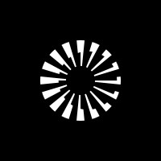
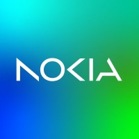

# Hi, I'm Eddy 👋

Engineering Manager and full-stack software engineer based in the San Francisco Bay Area.

Outside of work, I enjoy building side projects and exploring new technologies. I also enjoy playing soccer ⚽ and basketball 🏀, and going snowboarding 🏂.

## Experience

-  **Parafin**
-  **Plaid**
-  **Discord**
-  **LinkedIn**
-  **Microsoft**
-  **Nokia**

## Projects

- 🌙 **[Sleeping with Friends](https://sleepingwithfriends.com)** — A website that gamifies sleep tracking by letting friends compete on sleep metrics through leaderboards and data visualization.
- 👥 **[PlanShare.io](https://planshare.io)** — A platform for finding people to share subscriptions, group orders, and referrals. Built with React, TypeScript, and MongoDB.

## Technologies

## Education

-  **McGill University** — B.Eng, Electrical Engineering

## Connect

- [Blog](https://eddylu.com)
- [LinkedIn](https://linkedin.com/in/eddylu94)
- [X](https://x.com/eddylu88)
